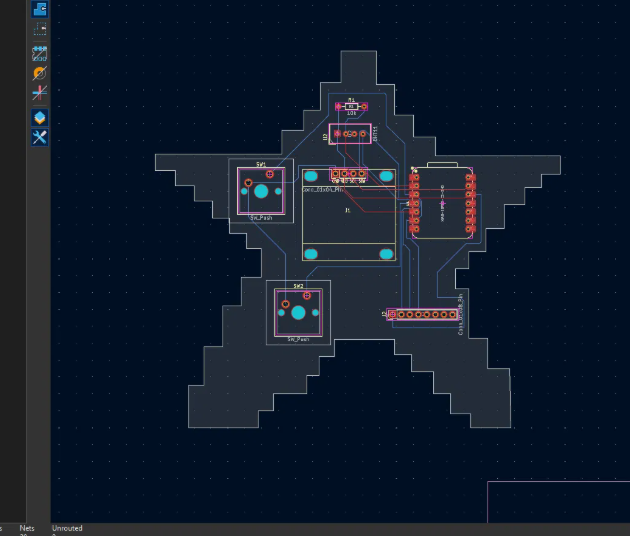
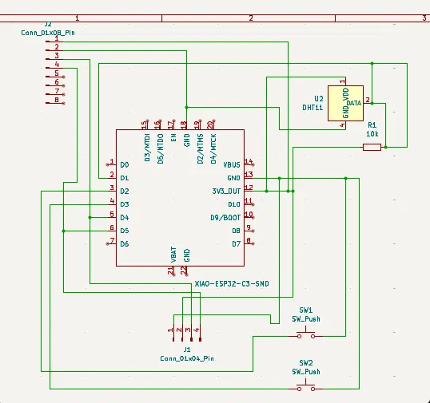

# My Starbie

A tiny star-shaped desk pet. A XIAO ESP32-C3 draws a wandering pet on a 0.96" OLED screen. You can open a radial menu with a button, tilt the board to pick an action, and check the room temperature and humidity on a stats screen.

I made this for Half Life Week 1, following the Starbie guide, and then changed it to make it my own.

## What I changed

- **Star-shaped board:** I drew my own star outline on the Edge.Cuts layer in KiCad, so the PCB itself is a star.
- **New menu action:** I replaced PET with **DANCE**, a more energetic move with its own joy/energy/fullness values.
- **Sparkle trail:** I added a `drawSparkle` function so a little star blinks behind the pet as it walks. It fits the star-shaped board.
- **Pull-up resistor:** the guide's written steps left out the 10k resistor on the DHT11 data line, so I found it in the guide's screenshot and wired it to 3.3V.

## Images

## Hardware

- Microcontroller: Seeed Studio XIAO ESP32-C3
- Display: 0.96" 128x64 I2C OLED (4-pin header)
- Motion sensor: MPU6050 module (8-pin header, shares the I2C lines with the OLED)
- Environment sensor: DHT11, with a 10k pull-up resistor on the data line
- Controls: 2 push buttons (Cherry MX style footprints)
- Board: custom star-shaped PCB designed in KiCad

### Pin connections

| Part | XIAO pin | ESP32-C3 GPIO |
| --- | --- | --- |
| OLED SDA and MPU6050 SDA | D4 | GPIO6 |
| OLED SCL and MPU6050 SCL | D5 | GPIO7 |
| DHT11 data | D1 | GPIO3 |
| Button 1 | D2 | GPIO4 |
| Button 2 | D3 | GPIO5 |

## Controls

| Control | What it does |
| --- | --- |
| Button 1, first press | Opens the radial menu |
| Tilt while the menu is open | Moves the selector ball |
| Button 1, second press | Chooses the highlighted action (NAP, PLAY, FEED, DANCE) |
| Button 2 | Shows or hides the stats screen |
| Shake the board | Gives the pet a shake reaction |

## Files

- `HalfLife10weeks/Hardware/`: KiCad project, footprint and symbol libraries, drill files and 3D models
- `HalfLife10weeks/Gerbers/`: manufacturing files for the PCB
- `HalfLife10weeks/Firmware/StarbieCode/`: Arduino sketch
- `HalfLife10weeks/Images/`: screenshots of the design

## Firmware

The code is an Arduino sketch based on the starter code from the Half Life Week 1 guide.

To upload it:
1. Install the Arduino IDE.
2. Add the ESP32 board package URL in File > Preferences: `https://espressif.github.io/arduino-esp32/package_esp32_index.json`
3. In Boards Manager, install **esp32 by Espressif Systems**, then select the board **XIAO_ESP32C3**.
4. Install the libraries: Adafruit GFX Library, Adafruit SSD1306, Adafruit MPU6050 and DHT sensor library.
5. Open `HalfLife10weeks/Firmware/StarbieCode/StarbieCode.ino` and upload.

## Status

- [x] Schematic finished
- [x] PCB routed and DRC checked
- [X] Gerbers exported
- [ ] Parts ordered and board built
- [ ] Firmware tested on real hardware

## What I learned

- How to use KiCad: drawing a schematic, assigning footprints, routing a board and running DRC.
- How to add imported footprint and symbol libraries.
- Why a DHT11 needs a pull-up resistor, and how to read a netlist log to find wiring mistakes.
- How to draw a custom board outline.

## What I'd improve

- Add a battery and a switch so it works without USB.
- Design a 3D-printed case in Fusion 360 for it.
- Draw my own pet sprite instead of the starter one.

## Credits

Based on the Starbie example project and Week 1 guide from Half Life by SharKingStudios: https://github.com/SharKingStudios/Starbie
